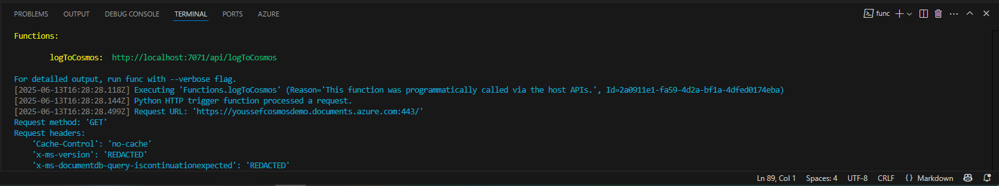
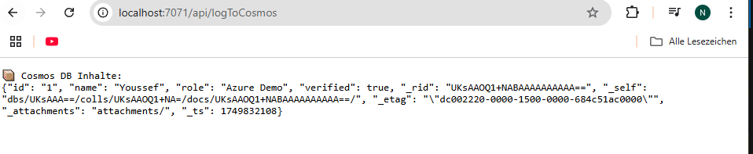
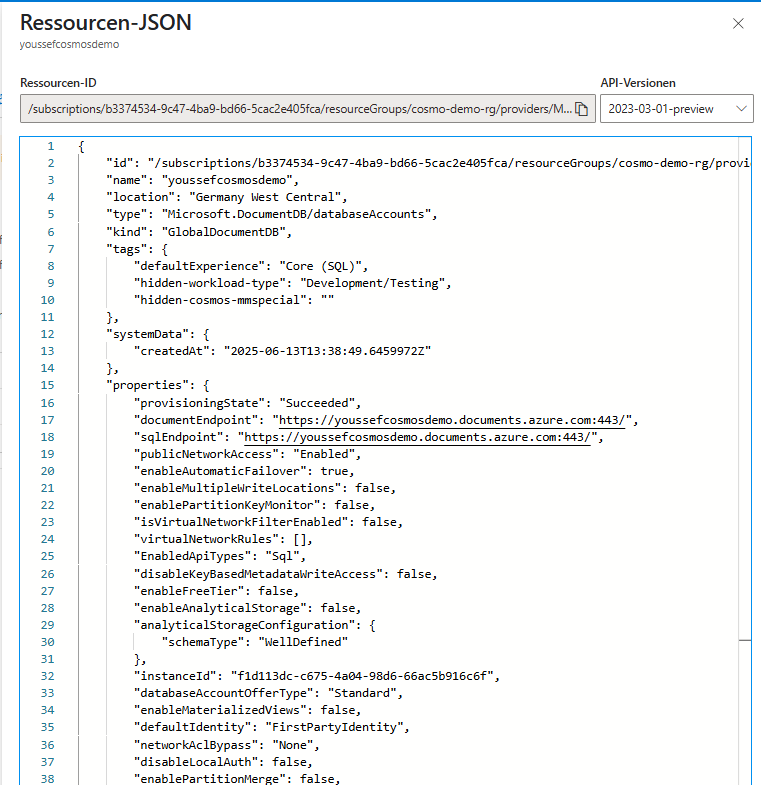

```markdown
# Azure Function with Cosmos DB (NoSQL)

This is a Python-based Azure Function project integrated with Azure Cosmos DB (NoSQL).  
It accepts HTTP requests, inserts data into Cosmos DB, and reads the stored items.

## 🔧 Technologies Used

- Azure Functions  
- Azure Cosmos DB (NoSQL)  
- Python 3.11  
- Visual Studio Code  
- HTTP Trigger (Function v2)

## 📦 Features

- Handles HTTP requests via Azure Functions  
- Automatically creates database and container if needed  
- Inserts a sample document into Cosmos DB  
- Reads and returns stored documents as plain text

## ▶️ How to Run

1. Clone this repository and open it in Visual Studio Code  
2. Activate the virtual environment:

   ```bash
   .\venv\Scripts\activate
   ```

3. Install the required packages:

   ```bash
   pip install azure-functions azure-cosmos
   ```

4. Ensure `local.settings.json` contains your Cosmos DB connection:

   ```json
   {
     "IsEncrypted": false,
     "Values": {
       "AzureWebJobsStorage": "UseDevelopmentStorage=true",
       "FUNCTIONS_WORKER_RUNTIME": "python",
       "COSMOS_DB_URL": "https://<your-account>.documents.azure.com:443/",
       "COSMOS_DB_KEY": "<your-key>"
     }
   }
   ```

5. Start the function app locally:

   ```bash
   func start
   ```

6. Test the function by opening this URL in a browser:

   ```bash
   http://localhost:7071/api/logToCosmos
   ```

## 📷 Screenshots

- ⚙️ Function running  
  

- 🌐 Cosmos DB HTTP Response  
  

- 📄 Azure Cosmos DB Resource JSON  
  


## 📁 Project Structure

```text
azure-function-cosmosdb-demo/
├── function_app.py
├── host.json
├── local.settings.json
├── requirements.txt
├── .vscode/
├── .venv/
├── images/
└── README.md
```

## 👤 Author

**Youssef Tayachi**  
📫 youssef.tayachi@syro-ai.com  
🔗 [github.com/YoussefTayachi](https://github.com/YoussefTayachi)
```
